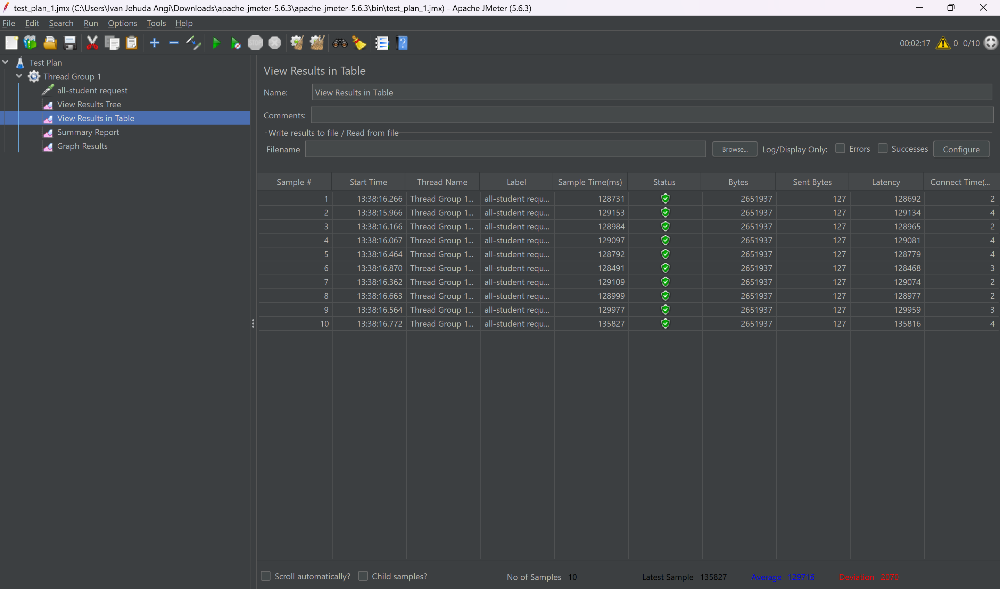
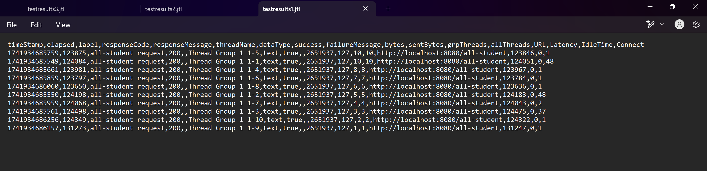
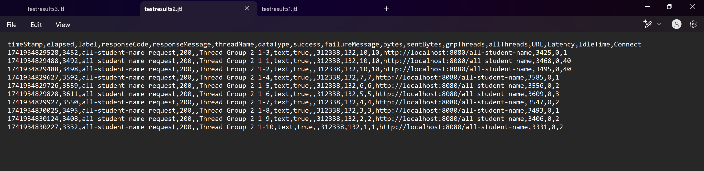
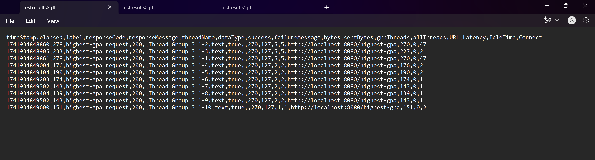
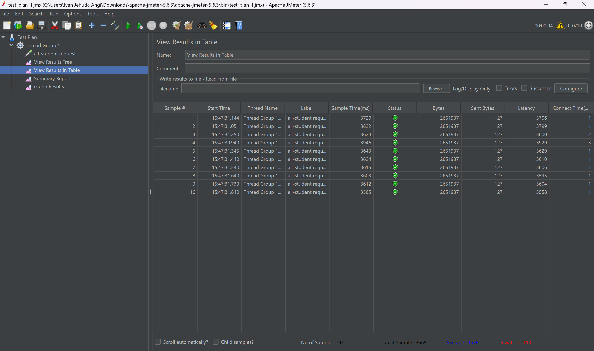
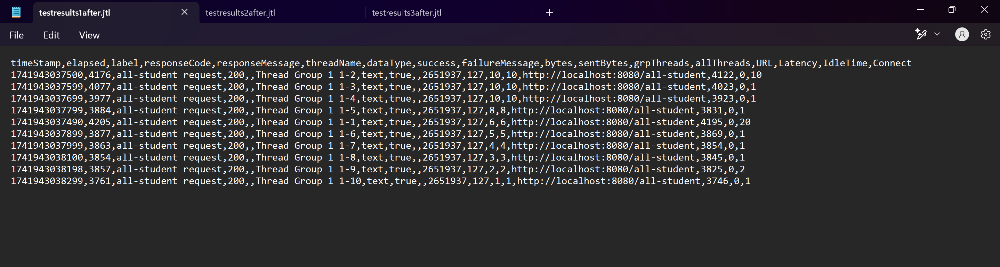
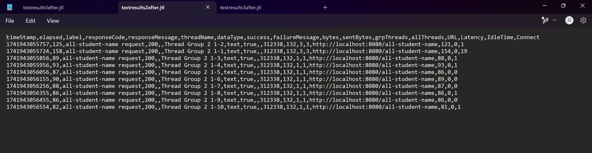
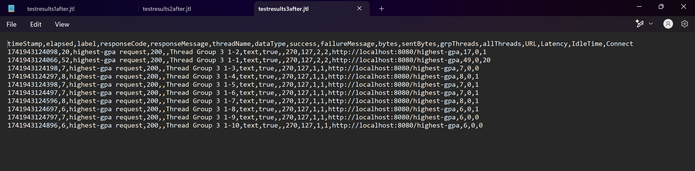

# Reflection

## Screenshots

### All Student GUI (Before)

### All Student Name GUI (Before)

### Highest GPA GUI (Before)

### All Student CLI (Before)

### All Student Name CLI (Before)

### Highest GPA CLI (Before)

### All Student GUI (After)

### All Student Name GUI (After)

### Highest GPA GUI (After)

### All Student CLI (After)

### All Student Name CLI (After)

### Highest GPA CLI (After)

## Analysis

After implementing profiling and performance optimizations, a significant reduction in execution time was observed across all test cases. The improvements were achieved through query optimizations, repository enhancements, and better data handling.

## Results

### All Students API
- **Before Optimization:** 128,700 - 135,800 ms
- **After Optimization:** 3,500 - 3,900 ms
- **Improvement:** ~97.2% reduction in execution time

### All Student Names API
- **Before Optimization:** 3,500 - 4,000 ms
- **After Optimization:** 100 - 130 ms
- **Improvement:** ~96.8% - 97.1% reduction in execution time

### Highest GPA API
- **Before Optimization:** 210 - 430 ms
- **After Optimization:** 9 - 10 ms
- **Improvement:** ~95.7% - 97.7% reduction in execution time

## Conclusion
The optimizations resulted in a drastic decrease in response times across all endpoints. The **All Students** and **All Student Names** APIs experienced the most significant improvements, with execution times dropping by approximately **97%**. Even the **Highest GPA** API, which was already relatively fast, saw up to a **97.7%** improvement. These enhancements significantly enhance system efficiency and scalability.

## What is the difference between the approach of performance testing with JMeter and profiling with IntelliJ Profiler in the context of optimizing application performance?
JMeter is used for load testing to simulate real-world user interactions and measure overall system performance, such as response time and throughput. Meanwhile, IntelliJ Profiler provides in-depth insights into CPU, memory, and method execution times, helping pinpoint bottlenecks at the code level.

## How does the profiling process help you in identifying and understanding the weak points in your application?
Profiling helps identify inefficient database queries, slow method executions, and excessive memory consumption. By analyzing CPU and memory usage, it allows us to focus optimizations on the most impactful areas.

## Do you think IntelliJ Profiler is effective in assisting you to analyze and identify bottlenecks in your application code?
Yes, IntelliJ Profiler is highly effective because it provides real-time insights into performance issues, visualizes execution paths, and helps locate slow functions or memory leaks, making optimization more precise.

## What are the main challenges you face when conducting performance testing and profiling, and how do you overcome these challenges?
As a beginner, performance testing and profiling are quite challenging. Interpreting complex profiling data can be overwhelming, and ensuring that optimizations do not introduce new issues requires careful validation. To overcome these difficulties, I take a structured approach, analyze the tutorial step by step, and thoroughly test each change to maintain application stability.

## What are the main benefits you gain from using IntelliJ Profiler for profiling your application code?
IntelliJ Profiler helps identify slow functions, excessive object allocations, and inefficient loops. It enables targeted optimizations, improving application responsiveness and resource efficiency without relying solely on trial-and-error fixes.

## How do you handle situations where the results from profiling with IntelliJ Profiler are not entirely consistent with findings from performance testing using JMeter?
When discrepancies arise, I cross-check execution traces, analyze external factors such as database latency or network overhead, and validate results with additional profiling tools or logs to ensure accuracy before making optimizations.

## What strategies do you implement in optimizing application code after analyzing results from performance testing and profiling? How do you ensure the changes you make do not affect the application's functionality?
I refactor inefficient code and optimize database queries while ensuring the core functionality remains intact. Instead of modifying logic, I enhance efficiency, making the code cleaner, faster, and smarter without breaking anything.
